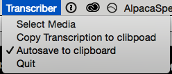
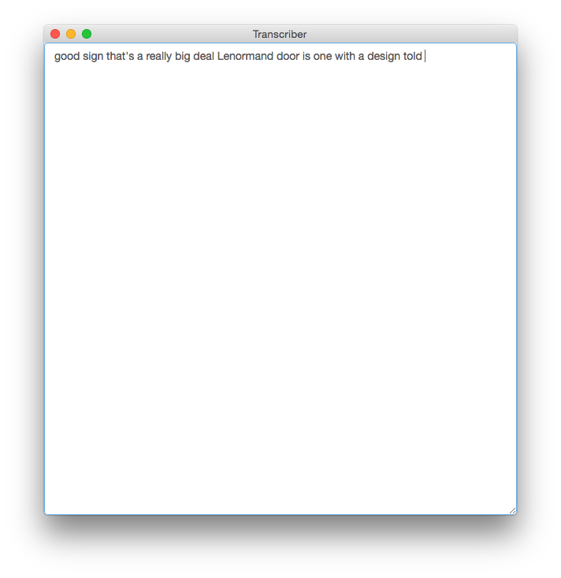

# Lightweight Speech to text desktop app for OSX Using IBM Watson API

This app was an initial prototype to test the quality of IBM STT, and is no longer activly supported I am now working on a more full fledge version at https://github.com/OpenNewsLabs/autoEdit_2 ( http://www.autoedit.io ).

## IBM Speech to text API

To use this app you need to get IBM Watson API keys for their speech to text service, by making an account with [Bluemix](https://console.ng.bluemix.net/)

## Usage - Development
If you clone the repo you can start the app with `npm start`.

## Usage - User
Or you can get the latest release packaged and ready for use [here](https://github.com/voxmedia/Transcriber/releases)

This is a Tray Menu app.



First you `Select Media`, audio or video you'd like to transcribe.

Notifications show when a transcription as started and when it's finished.

On completion a editable text area shows you the transcription.



By default the transcription is also saved to clipboard.

You can disable `Autosave to clipboard` if working on text editing or making use of the system clipboard for some other program to avoid it overwriting something else you might be doing with it.

## Setting IBM Watson API keys

First time you start the application you'd be prompt to set the API keys.

Should you need to change those you can use shortcut `cmd + shift + a`.

These are saved inside the app as a json file `wttskeys.json` at the root of the application.

Which is in the `.gitignore` so that it doesn't accidentally gets added to git by mistake, when in development mode.


## Overview of project

- Once you select a video, the app converts it into audio and sends it to the IBM Speech to text API.
- When the transcription comes back it's copied to clipboard, unless you un-tick the option in the menu.
- Paste the transcription wherever you want and take it from there.

## Technical overview

### Convert video to audio
The `video_to_audio` module converts video or audio into IBM audio specs.  Initially modified from [Sam Lavine](https://github.com/antiboredom)'s [gist](https://gist.github.com/pietrop/5008653567df73d813e525c6b89b23b6).

Audio files are saved in `./tmp/audio` folder.

<!-- more on IBM audio specs here -->

### IBM Speech to text API
The `stt` folder contains the module to interact with the IBM Speech to text API.
If you want to dive more into this [their documentation](https://www.ibm.com/smarterplanet/us/en/ibmwatson/developercloud/speech-to-text/api/v1/#api_explorer) on how to interact with the API is pretty good.

### Transcribing video
`transcribe.js` requires both modules described above and brings it all together.

Converts audio into video, and then sends it to Watson for transcriptions. Transcriptions are saved onto a text file in `./tmp/text` folder.

module returns the path to the text file.

`index.js` abstracts `transcribe.js` in case the interface needs to change at a later stage.

### NWJS
`indext.html` contains the Implementation of the NWJS app.
Adding Menu Tray to the application.

See comments in the code [``./index.html`](./index.html) and [nwjs wiki](https://github.com/nwjs/nw.js/wiki) as well as [nwjs documentation](http://docs.nwjs.io/en/latest/) for more on this.

## User flow
When a user selects a video it's transcribed, appropriate system notifications for start and end are triggered.

When done unless option is un-ticked transcription is saved to clipboard.

in which case user can click on `Copy transcriptions to cliboard` to get the transcriptions.

## Build NWJS app

### Option 1

Use deploy script

```
node deploy.js
```

This creates a build folder inside the repo. The build folder is also in `.gitignore` to avoid accidentally pushing it to remote.

### Option 2
To rebuild the app in NWJS refer to the [documentation](http://docs.nwjs.io/en/latest/For%20Users/Package%20and%20Distribute/)

Install `nw-builder`

```
npm install -g nw-builder
```

From one level above the application folder (`cd ..` from root of repo)

```
nwbuild -p osx64 ./transcriber
```

creates a `build` folder that contains the app

## Todo

- [ ] Write proper test using testing framework.
- [ ] Ad some proper form of error handling
- [ ] IBM has a size limit of 100mb per audio post request. Double check if there's a use case when converting video to audio it exceeds that size. Rough test with 54gb video to audio with that module ended up 50 to 70 mb. So it would seem ok for now?


<!-- icon img  https://pixabay.com/en/switch-detonator-buttons-153517/ -->
